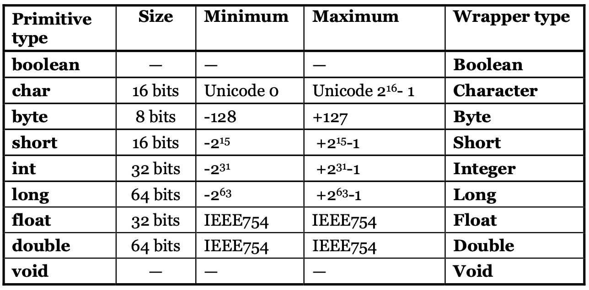

# Thinking in java(Fourth Edition)
    thinking in java notes
## Chapter 2: 一切都是对象
### 2.1 用引用操纵对象
1.C++和Java都是混合/杂合型语言。
2.可以将这种情形想像成用遥控器（引用）来操纵电视机（对象），只要握住这个遥控器，就能保持与电视机的连接，当有人想改变
音量或者频道，实际操控的是遥控器（引用），再由遥控器来调控电视机（对象），如果想在房间四处走走，同时仍能调控电视机，
那么只需携带遥控器（引用）而不是电视机（对象）。 
#### String创建对象问题
1.String str=new String("abc");创建了几个String对象呢？   
答案应该是1个或者2个。   
1个的情况:如果字符串池中已经存在了"abc"这个对象，那么直接在创建一个对象放入堆中，返回str引用。   
2个的情况:如果字符串池中未找到"abc"这个对象，那么分别在堆中和字符串池中创建一个对象，字符串池中的比较都是采用equals()方法。
### 2.2 必须由你创建所有对象
1.对象的存储：  
(1)寄存器：这是最快的存储区，因为他位于处理器内部，但数量极其有限；     
(2)堆栈：位于通用RAM（随机访问存储器），通过指针上下移动分配内存，仅次于寄存器，但是Java系统必须知道存储在堆栈内所有
项的确切生命周期，以便上下移动堆栈指针，因此失去了灵活性，所以虽然某些Java数据存储于堆栈中（特别是对象引用），但是Java
对象并不存储于其中；  
(3)堆：一种通用的内存池（也位于RAM区），用于存放所有的java对象，不同于堆栈，编译器不需要知道存储的数据在堆里存活多长
时间，因此在堆里分配存储有很大的灵活性，但是相较于堆栈，进行存储分配和清理用的时间多；
(4)常量存储：常量通常直接存放在程序代码内部，这样做是安全的，因为它们永远不会被改变；  
(5)非RAM存储：如果数据完全存活于程序之外，例如：流对象和持久化对象，如JDBC和Hibernat。  
----------------------------------------------------------------------------------------------------   
On Java 8:  
那么，程序在运行时是如何存储的呢？尤其是内存是怎么分配的。有5个不同的地方可以存储数据：  
1.寄存器（Registers）最快的存储区域，位于 CPU 内部 ^2。然而，寄存器的数量十分有限，所以寄存器根据需求进行分配。我们  
对其没有直接的控制权，也无法在自己的程序里找到寄存器存在的踪迹（另一方面，C/C++ 允许开发者向编译器建议寄存器的分配）。  
2.栈内存（Stack）存在于常规内存 RAM（随机访问存储器，Random Access Memory）区域中，可通过栈指针获得处理器的直接  
支持。栈指针下移分配内存，上移释放内存，这是一种快速有效的内存分配方法，速度仅次于寄存器。创建程序时，Java 系统必须  
准确地知道栈内保存的所有项的生命周期。这种约束限制了程序的灵活性。因此，虽然在栈内存上存在一些 Java 数据，特别是对象  
引用，但 Java 对象却是保存在堆内存的。  
3.堆内存（Heap）这是一种通用的内存池（也在 RAM 区域），所有 Java 对象都存在于其中。与栈内存不同，编译器不需要知道  
对象必须在堆内存上停留多长时间。因此，用堆内存保存数据更具灵活性。创建一个对象时，只需用 new 命令实例化对象即可，当执  
行代码时，会自动在堆中进行内存分配。这种灵活性是有代价的：分配和清理堆内存要比栈内存需要更多的时间（如果可以用 Java   
在栈内存上创建对象，就像在 C++ 中那样的话）。随着时间的推移，Java 的堆内存分配机制现在已经非常快，因此这不是一个值得  
关心的问题了。
4.常量存储（Constant storage）常量值通常直接放在程序代码中，因为它们永远不会改变。如需严格保护，可考虑将它们置于只  
读存储器 ROM （只读存储器，Read Only Memory）中 ^3。  
5.非 RAM 存储（Non-RAM storage）数据完全存在于程序之外，在程序未运行以及脱离程序控制后依然存在。两个主要的例子：  
（1）序列化对象：对象被转换为字节流，通常被发送到另一台机器；（2）持久化对象：对象被放置在磁盘上，即使程序终止，数据  
依然存在。这些存储的方式都是将对象转存于另一个介质中，并在需要时恢复成常规的、基于 RAM 的对象。Java 为轻量级持久化提  
供了支持。而诸如 JDBC 和 Hibernate 这些类库为使用数据库存储和检索对象信息提供了更复杂的支持。  
----------------------------------------------------------------------------------------------------  
2.用new将对象存储在"堆"里，故用new创建一个对象————特别是小的，简单的变量，往往不是很有效，因此在Java中，基本类型存储于
堆栈中，因此更加高效。  
3.Java要确定每种基本类型所占存储空间的大小，并不随机器硬件架构的变化而变化，因此Java更具可移植性。  

1 Byte = 8 Bits;   
1 KB = 1024 Bytes;   
1 MB = 1024 KB;   
1 GB = 1024 MB;  
Bit意为“位”或“比特”，是计算机运算的基础，属于二进制的范畴；   
Byte意为“字节”，是计算机文件大小的基本计算单位；    
另外，Byte通常简写为B(大写），而bit通常简写为b（小写）。可以这么记忆，大写的为大单位，实际数值小，小写的为小单位，实际数值较大，1B=8b。   
4.基本类型具有包装器类，使得可以在堆中创建一个非基本对象，用来表示对应的基本类型：   
char c = 'x'; Character ch = new Character(c);  
也可以这样用：  
Character ch = new Character('x');   
自动包装功能自动地将基本类型转换为包装器类型：Character ch = 'x'; 并可以反向转换： char c = ch。   
5.Java提供了两个高精度计算的类：BigInteger和BigDecimal,虽然它们大体上属于"包装器类"的范畴，但二者都没有对应的基本类型
不过这两个类包含的方法与基本类型相似，也就是说，能作用于int或者float的操作，也能同样作用于BigInteger和BigDecimal，不过
必须以方法调用方式取代运算符方式来实现，因此速度比较慢，在这里我们用速度换取精度。  
BigInteger：支持任意精度整数，可以精确地表示任何大小的整数值，而不会丢失任何信息；  
BigDecimal：支持任意精度定点数，可用它进行精确的货币计算。  
6.Java确保数组会被初始化，而且不能在它的范围之外被访问，这种范围检查，是以每个数组上少量的内存开销及运行时的下标检查为代价的。  
### 2.3 永远不需要销毁对象
1.作用域（scope）决定了在其内定义的变量名的可见性和生命周期，作用域由花括号的位置决定。  
2.由new创建的对象，只要你需要，就会一直保留下去。Java又一个垃圾回收器，用来监视用new创建的所有对象。  
### 2.4 创建新的数据类型：类
### 2.5 方法，参数和返回值
1.方法名和参数列表合起来被称为"方法签名",`方法签名唯一的标识出某个方法，不能用返回类型或者访问控制关键字来区别方法。`  
2.Java中的方法只能作为类的一部分来创建，方法只能通过对象才能被调用。  
### 2.6 构建第一个Java程序
1.包名小写。  
2.可以使用关键字import来准确的告诉编译器你想要的类是什么，import指示。编译器导入一个包，也就是一个类库。   
3.使用static关键字可以解决两方面问题：     
(1)只想为某特定域分配单一存储空间，而不去考虑究竟要创建多少对象，甚至根本就不创建任何对象；  
(2)希望某个方法不与包含它的类的任何对象关联在一起，也就是说，即使没有创建对象，也能够调用这个方法；  
`当声明一个事物是static时，就意味着这个域或方法不会与包含它的那个类的任何对象实例关联在一起，所以即使从未创建某个类
的任何对象，也可以调用其static方法或访问其static域。`
public class StaticTest {  
    static int i = 47;  
}  
即使创建两个StaticTest对象，StaticTest.i 也只有一份存储空间，这两个对象共享一个i
StaticTest staticTest1 = new StaticTest();  
StaticTest staticTest2 = new StaticTest();  
这里 staticTest1.i 和 staticTest2.i 指向同一存储空间，因此它们具有相同的值47，建议使用StaticTest.i 。  
4.类似逻辑也用于静态方法，ClassName.method(); static方法的一个重要用法就是在不创建任何对象的前提下就可以调用它。  
5.和其他任何方法一样，static方法可以创建或者使用与其类型相同的被命名对象，因此，static方法常常拿来做"牧羊人"的角色，负责看护与其
隶属同一类型的实例群。
### 2.7 你的第一个Java程序
1.java.long会自动被导入到每一个Java文件中（默认）。  
2.main()方法的参数是一个String对象的数组，在程序中并未用到args，但是Java编译器要求必须这样做，因为args要用来存储命令行参数。  
### 2.8 注释和嵌入式文档 
1.所有的javadoc命令都只能在"/**"注释中出现。   
2.javadoc只能为public和protected成员进行文档注释，private和包内可访问成员的注释会被忽略掉，（不过可以用 -private进行标记，
以便把private成员的注释也包括在内），只有public和protected成员才能在文件之外被使用。
